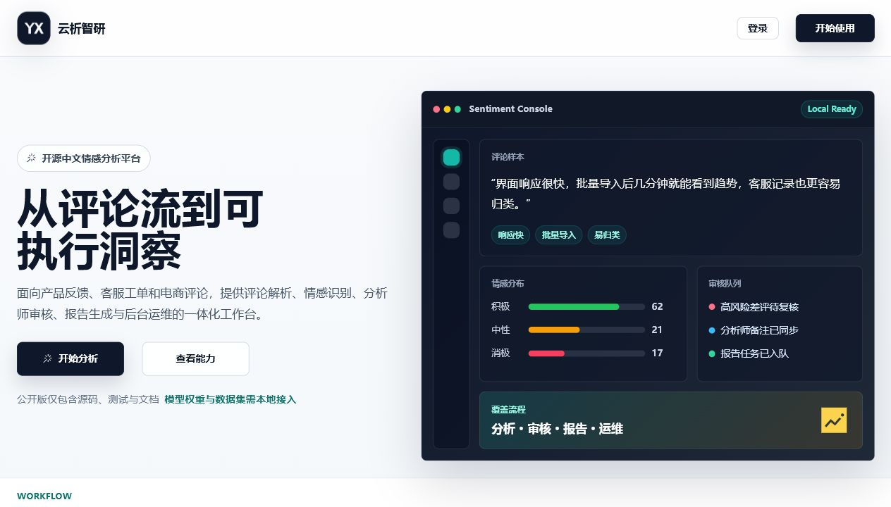

# SentimentPlatform

[](https://github.com/s1oopX/SentimentPlatform-Open/actions/workflows/ci.yml)
[](LICENSE)
[](https://www.djangoproject.com/)
[](https://vuejs.org/)

SentimentPlatform（云析智研）是一套面向中文评论数据的智能情感分析与洞察平台。系统围绕评论采集、情感识别、结果沉淀、人工复核、报告生成、模型训练和后台治理构建完整业务闭环，适用于产品反馈分析、服务评价监测、电商评论归因、客服工单洞察等中文文本分析场景。

项目采用前后端分离架构：前端基于 Vue 3 提供三角色工作台，后端基于 Django REST Framework 提供认证、分析、报告、训练和管理接口，异步任务由 Redis/Celery 承载，机器学习工作区支持 Transformer、传统机器学习和神经网络基线模型。平台同时提供 RBAC 权限控制、操作审计、文件导入导出、训练记录追踪和自动重训触发机制，便于在本地或内网环境中完成可验证、可扩展的中文情感分析系统建设。

## 公开版本说明

本仓库是 SentimentPlatform 的公开源码版本，仅发布系统源码、自动化测试、文档、前端品牌资源和开发脚本。公开版本不包含以下本地资产：

| 类型 | 公开策略 |
| --- | --- |
| `.env`、真实密钥、本地账号 | 不发布 |
| 训练数据集、Arrow 文件、数据切分结果 | 不发布 |
| 模型权重、`.joblib`、`.pt`、`.safetensors` 训练产物 | 不发布 |
| 本地数据库、日志、上传文件、报告导出、备份文件 | 不发布 |

运行真实分析、训练或模型激活功能前，需要根据 [模型与数据资产说明](docs/model-and-data-assets.md) 在本地准备模型、数据集和必要配置。

## 界面预览



公开版首页展示平台主要工作流和产品入口，不包含真实业务数据、账号、模型权重或训练资产。

## 核心能力

| 能力域 | 说明 |
| --- | --- |
| 账号与权限 | 图形验证码、邮箱验证码、注册登录、JWT access token、HttpOnly refresh cookie、三角色权限控制 |
| 评论分析 | 单条分析、TXT/XLSX 批量分析、批量模板下载、运行时模型能力检测、分析历史与详情 |
| 分析师复核 | 全局评论检索、情感修正、审核备注、重点关注、趋势统计、报表导出 |
| 报告中心 | PDF、Excel、CSV 报告生成，异步任务入队，状态追踪，安全下载 |
| 管理后台 | 用户管理、数据集沉淀与导出、模型注册与激活、训练中心、日志审计、数据库备份 |
| 模型训练 | Transformer 微调、Transformer 超参搜索、传统模型对比、TextCNN/BiLSTM 基线训练 |
| 自动重训 | 根据高置信度样本和人工审核样本构建训练数据批次，按阈值触发训练或记录提醒 |
| 运维治理 | Celery Beat 定时任务、日志保留策略、异常训练任务清理、路径安全校验 |

## 角色设计

| 角色 | 前端路径 | 权限范围 | 典型操作 |
| --- | --- | --- | --- |
| 普通用户 | `/user/*` | 访问本人分析历史和报告 | 单条分析、批量上传、查看历史、生成报告、维护资料 |
| 分析师 | `/analyst/*` | 查看全局分析结果和统计报表 | 评论复核、情感修正、重点标注、报表查看与导出 |
| 管理员 | `/admin/*` | 管理系统级资源 | 用户管理、模型切换、训练编排、数据集导出、日志与备份 |

登录成功后，前端会根据用户角色跳转到对应首页；后端接口权限与前端路由守卫共同限制越权访问。

## 业务流程

```text
用户提交评论 / 上传文件
        ↓
文本校验、文件解析、批量行数限制
        ↓
模型推理与关键词归一化
        ↓
评论与分析结果入库
        ↓
用户查看历史 / 分析师复核修正 / 报告生成
        ↓
有效标注沉淀为训练数据集
        ↓
管理员训练、评估、注册并激活模型
```

分析结果会记录分析渠道、分析会话、来源名称、模型原始情感、人工修正情感、审核人、审核时间和自动训练数据集引用。高置信度样本可自动进入训练数据池，低置信度样本需分析师复核后进入自动重训候选。

## 系统架构

| 层级 | 主要组件 | 说明 |
| --- | --- | --- |
| 前端表现层 | Vue 3、Vite、Pinia、Vue Router、Element Plus、Tailwind CSS、ECharts | 提供用户端、分析师端和管理员端工作台 |
| API 服务层 | Django 6、Django REST Framework、Simple JWT、drf-spectacular | 提供认证、分析、报告、管理、训练等 REST API |
| 业务应用层 | `apps/users`、`apps/analysis`、`apps/reports`、`apps/admin_panel` | 按业务边界组织接口、应用服务、领域规则和数据访问 |
| 数据与缓存层 | MySQL 8、Redis | 保存业务数据、任务状态、缓存和 Celery broker/backend |
| 异步任务层 | Celery 5.6、Celery Beat | 执行报告生成、训练任务、清理任务、自动重训检查 |
| 模型工作区 | PyTorch、Transformers、scikit-learn、jieba、datasets | 支持多类型模型推理、训练、评估和产物登记 |

## 数据模型

系统当前围绕 8 张核心业务表组织数据：

| 表名 | Django 模型 | 说明 |
| --- | --- | --- |
| `users` | `users.User` | 自定义用户表，支持 user、analyst、admin 三类角色 |
| `email_verification_codes` | `users.EmailVerificationCode` | 邮箱验证码、用途、失败次数和过期控制 |
| `comments` | `analysis.Comment` | 评论正文、项目名、评分、类别、来源、评论时间 |
| `analysis_results` | `analysis.AnalysisResult` | 情感类别、置信度、关键词、分析渠道、人工修正、审核信息、自动训练数据集引用 |
| `models` | `analysis.Model` | 模型注册、版本、指标、路径、激活状态、运行时兼容性 |
| `training_runs` | `admin_panel.TrainingRun` | 训练任务、数据集引用、配置快照、指标、产物和日志路径 |
| `reports` | `reports.Report` | 报告类型、格式、状态、文件路径、摘要和入队信息 |
| `operation_logs` | `admin_panel.OperationLog` | 登录、分析、导入导出、训练、模型切换等审计日志 |

## 技术栈

| 类型 | 技术 |
| --- | --- |
| 后端 | Python 3.12+、Django 6、Django REST Framework、Simple JWT、drf-spectacular |
| 前端 | Vue 3.5、Vite 8、Pinia、Vue Router 5、Element Plus、Tailwind CSS 4、ECharts |
| 数据库与缓存 | MySQL 8+、Redis |
| 异步任务 | Celery 5.6、Celery Beat |
| 机器学习 | PyTorch、Transformers、scikit-learn、jieba、datasets、safetensors |
| 报告与文件 | ReportLab、openpyxl、CSV/TXT/XLSX 文件处理 |
| 工程质量 | pytest、ruff、ESLint、Prettier、vue-tsc、GitHub Actions |

## 项目结构

```text
SentimentPlatform/
├── sentiment_server/                 # Django REST API、Celery、模型推理与训练工作区
├── sentiment_webapp/                 # Vue 3 + Vite 前端单页应用
├── docs/                             # 公开发布、模型与数据资产说明
├── .github/                          # CI、issue 模板和 PR 模板
├── start-dev.ps1                     # 一键启动后端、Celery、前端
├── stop-dev.ps1                      # 一键停止本地服务
├── dev-services.ps1                  # 本地服务定义与复用函数
├── LICENSE                           # MIT License
├── CONTRIBUTING.md                   # 贡献指南
├── SECURITY.md                       # 安全策略
└── README.md                         # 项目介绍、启动与验证说明
```

公开版本采用 monorepo 组织，后端和前端位于同一个 Git 仓库中，便于统一管理 issue、CI、版本和文档。

## API 概览

| 前缀 | 说明 |
| --- | --- |
| `/api/healthz/` | 服务健康检查 |
| `/api/auth/` | 验证码、注册、登录、刷新、退出、资料、密码 |
| `/api/analyze/` | 单条/批量分析、模板、历史、详情、分析师视图、分析师报表导出 |
| `/api/report/` | 报告生成、报告列表、报告下载 |
| `/api/admin/` | 用户、日志、仪表盘、备份、数据集、自动重训状态、模型、训练中心 |
| `/swagger/`、`/redoc/` | OpenAPI 文档，需设置 `SWAGGER_ENABLED=True`，且管理员访问 |

## 本地环境要求

- Python `3.12+`
- Node.js `22.18+` 或 `24.11+`
- MySQL `8+`，默认 `127.0.0.1:3306`
- Redis，默认 `127.0.0.1:6379/0`
- PowerShell `7.0+`，用于一键启停脚本

## 快速开始

### 后端

```powershell
cd sentiment_server
python -m venv .venv
.venv\Scripts\Activate.ps1
pip install -e ".[training,testing]"
Copy-Item .env.example .env
```

编辑 `.env`，至少填写 `SECRET_KEY`、`JWT_SIGNING_KEY` 和数据库连接信息。随后执行：

```powershell
$env:DJANGO_SETTINGS_MODULE = "sentiment_server.settings.local"
python manage.py migrate
python manage.py check
python -m pytest -q
python manage.py runserver 127.0.0.1:8000
```

### 前端

```powershell
cd sentiment_webapp
npm install
npm run check
npm run build
npm run dev
```

Vite 开发服务默认访问 `http://127.0.0.1:5173/`，通过代理访问后端 `/api`。

### 一键启动

```powershell
.\start-dev.ps1
.\stop-dev.ps1
```

一键启动会检查后端 `.env` 必填密钥、MySQL 连接和 Redis 连接，然后拉起 Django、Celery default worker、Celery training worker、Celery beat 和 Vite 开发服务。健康检查地址为 `http://127.0.0.1:8000/api/healthz/`。

也可以只启动部分服务：

```powershell
.\start-dev.ps1 -Services backend,frontend
```

## 异步任务

| 队列或定时任务 | 用途 |
| --- | --- |
| `celery` 默认队列 | 报告生成、验证码清理、日志清理等通用任务 |
| `training` 队列 | 模型训练、训练后处理、训练产物登记 |
| Beat 每 5 分钟 | 清理异常停留的训练任务 |
| Beat 每小时 | 自动重训阈值检查 |
| Beat 每 6 小时 | 操作日志清理 |
| Beat 每天 03:30 | 过期验证码清理 |

## 质量验证

最近一次在本地工作区完成的检查：

```powershell
cd sentiment_server
$env:DJANGO_SETTINGS_MODULE = "sentiment_server.settings.local"
python manage.py check
python manage.py makemigrations --check --dry-run
python -m ruff check .
python -m pytest -q

cd ..\sentiment_webapp
npm run check
npm run build
```

验证结果：后端系统检查通过，迁移检查无遗漏，ruff 通过，后端测试 `122 passed`，前端 lint、Prettier、vue-tsc 和生产构建均通过。

## 文档索引

- 公开发布说明：[`docs/open-source-release.md`](docs/open-source-release.md)
- 模型与数据资产说明：[`docs/model-and-data-assets.md`](docs/model-and-data-assets.md)
- 后端说明：[`sentiment_server/README.md`](sentiment_server/README.md)
- 前端说明：[`sentiment_webapp/README.md`](sentiment_webapp/README.md)
- 前端设计规范：[`sentiment_webapp/DESIGN_SPEC.md`](sentiment_webapp/DESIGN_SPEC.md)
- 手工测试素材：[`sentiment_server/tests/fixtures/manual_usage/README.md`](sentiment_server/tests/fixtures/manual_usage/README.md)

## 许可证

本项目以 [MIT License](LICENSE) 开源。
